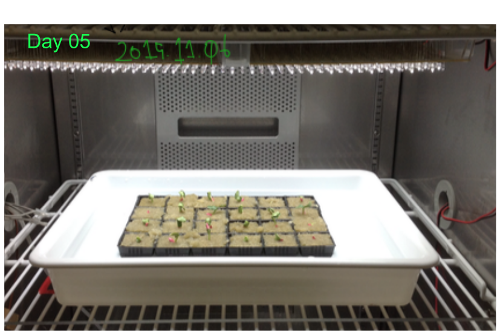
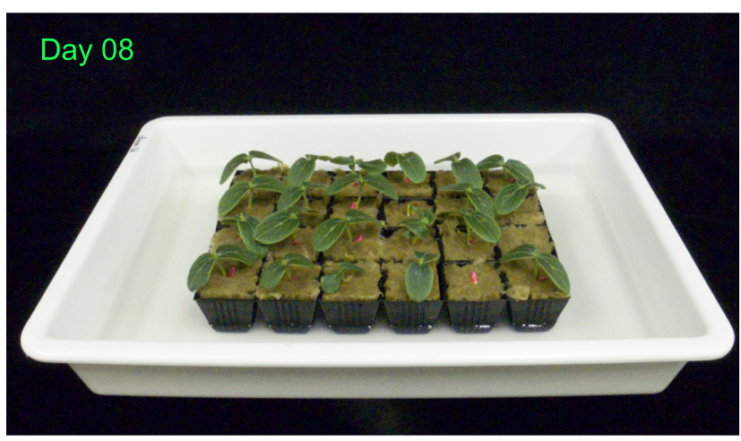

```{r message = F, warning = F, echo = T}
devtools::source_url("https://raw.githubusercontent.com/KeachMurakami/Sources/master/Startup_silent.R")

stem_dat <-
  fread("~/Dropbox/KeachMurakami.github.io/_supplemental/protocols/cucumber/stem_height_log.csv") %>%
  mutate(Date_measured = ymd(Date_measured), Date_sowing = ymd(Date_sowing),
         days = Date_measured - Date_sowing) %>%
  filter(Remark %in% c("W", "WFR", ""), !(Experiment %in% c("1607", "1608", "x1"))) %>%
  select(days, Experiment, PlantNo, Remark, stem_mean = Stem_length)

selection_plot <-
  stem_dat %>%
  filter(days == "8") %>%
  mutate(Remark = if_else(Remark %in% c("", " "), "not used", Remark)) %>%
  ggplot(aes(x = stem_mean, fill = Remark)) +
  geom_histogram() +
  facet_grid(Remark ~ .) +
  labs(x = "stem height [cm]")

stem_plot <-
  stem_dat %>%
  filter(!(Remark %in% c("", " "))) %>%
  group_by(Experiment, Remark, days) %>%
  summarise(stem_sd = sd(stem_mean, na.rm = T), stem_mean = mean(stem_mean, na.rm = T)) %>%
  ggplot(aes(x = days, y = stem_mean, col = Experiment, group = Experiment)) +
  geom_point() +
  geom_point(data = stem_dat %>% filter(Remark != ""), alpha = .25) +
  geom_line() +
  facet_grid(~ Remark) +
  gg_y(c(0, 12)) +
  labs(x = "days from sowing [d]", y = "stem height [cm]")
```

# キュウリの栽培プロトコル

第一本葉で光合成速度を測定できる程度の大きさのキュウリ苗をつくるためのプロトコルです  
不明な点は問い合わせてください  


- 供試品種: [北進 (タキイ種苗)](http://www.takii.co.jp/CGI/tsk/shohin/shohin.cgi?breed_seq=00000108)
- 必要な育苗日数: 14日


## 播種から処理開始まで (day 00--08)

0. 播種する種子の数を決める
    - 測定する株数の3--4倍程度の種子を播種
1. 50 mm ✕ 50 mm の[ロックウール (マルチブロック)](http://www.nittobo.co.jp/business/environment-health/green/grodan/syouhin.html)を72穴セルトレイに詰め、dH~2~O (あるいは水道水, お好み) 5.0 L に浸す
2. 種子をロックウール中心の穴部に植える
    - 種子の上下方向はさほど重要ではなさそう
3. グロースチャンバ内に静置する
    - チャンバ内の環境条件
        - 明暗周期: 16 h / 8 h
        - 明暗期気温: 25C / 20C
        - 明期PPFD: 300 µmol m^-2^ s^-1^ (植物上端の位置で測定)

- バット内の水が蒸発し、水位が低下した場合、随時給水する
- 1--2日に1回程度、セルトレイを回転させ、個体の光環境が均一になるよう心がける
- 播種からおよそ4日目、ほぼ全ての種子が発芽した時点で、dH~2~Oを捨て、培養液 (5.0 L; 大塚A処方 0.5単位, 1.2--1.4 dS m^-1^) に切り替える
- 種皮が子葉から自然に外れない場合、種皮を濡らし、柔らかくした上で取り除く




## 移植/処理開始

1. 地上部の高さ・第一本葉の長さ・外観 (奇形葉がないか)、を評価する
2. 試験区間で上記の評価項目にばらつきが生じないよう、適切に区分けする

- 経験上、地上部の高さは2.0 cm 前後のものがよい
- 種皮が遅くまで残っていると、子葉が奇形になりがち



選抜時の地上部の高さの分布

```{r message = F, warning = F, echo = T}
selection_plot
```

## 処理開始から測定まで (day 08--14/15/16)

- 1日1回、30 min 程度の底面給水を行う
    - 培養液に藻が発生させないため、移植以降は湛液せず
    - 毎日の世話が面倒ならば、湛液でもよいかもしれない
- 1日1回、セルトレイを回転させ、個体の光環境が均一になるよう心がける
- 2日に1回程度、地上部の高さを測定して成長記録をとっておく

処理開始後の地上部の高さの推移

```{r message = F, warning = F, echo = T}
stem_plot
```


## 測定 (day 14/15/16)

適宜、測定に供試する

[day14の外観; link](http://onlinelibrary.wiley.com/store/10.1111/ppl.12421/asset/supinfo/ppl12421-sup-0001-FigureS1.pdf?v=1&s=677bc5fc64b632917af7d2d801b950631f2e8270)

^\*^移植以降、Wは白色LEDのみで栽培、WFRは白色LED+遠赤色LEDで栽培


# References

- [Murakami et al. (2016, *Physiologia Plantarum*)](http://onlinelibrary.wiley.com/wol1/doi/10.1111/ppl.12421/abstract)
- [タキイ種苗株式会社, 品種カタログ](http://www.takii.co.jp/CGI/tsk/shohin/shohin.cgi?breed_seq=00000108)
- [日東紡 グロダンロックウール ONLINE](http://www.nittobo.co.jp/business/environment-health/green/grodan/syouhin.html)


# Disclaimer

プロトコルの利用により生じたいかなる問題に対しても、著者は責任を持ちません