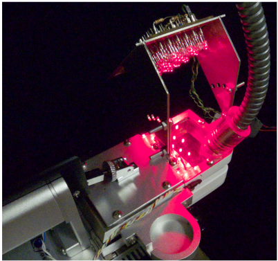
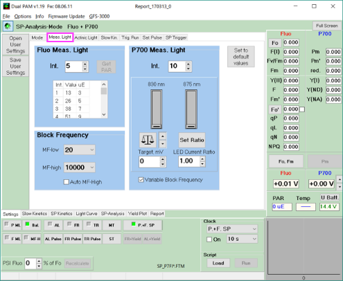
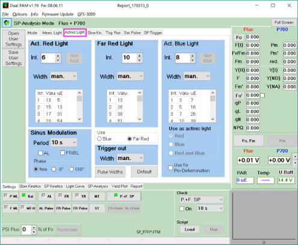
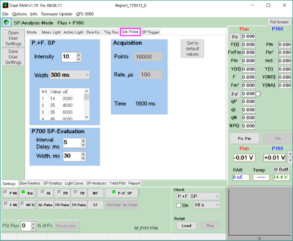
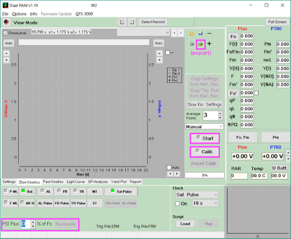
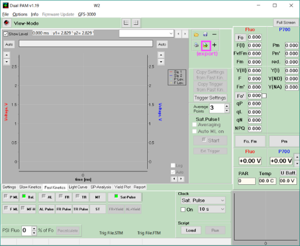
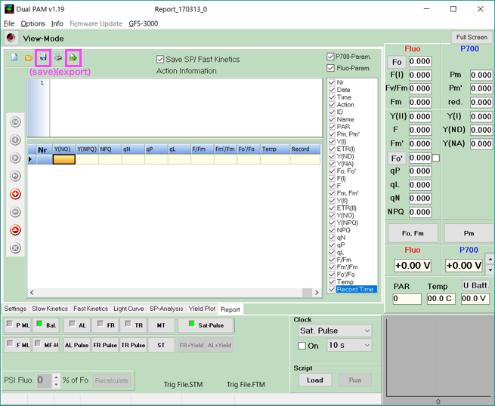

DUAL-PAM/F の簡易マニュアル
===========================

[Heiz Walz社](http://www.walz.com/)製のP700吸光度変化・クロロフィル蛍光計測器 ([DUAL-PAM/F](http://www.walz.com/products/chl_p700/dual-pam-100/fiber_version.html); 以下では単にPAMと記載) の使用方法を簡単に説明します。

-   実際の測定での手続き・注意点を書きます。
-   測定原理・パラメータの解釈のためには、まず以下の文献を読んでください。
    -   PAM全般に関して
        -   Klughammer and Schreiber (1994)
    -   PSIに関して
        -   Klughammer and Schreiber (2008)
        -   Klughammer et al. (2013)
    -   PSIIに関して
        -   Kramer et al. (2004)
-   fast kinetics計測、flux mode計測に関しては知識がないので、記述しません。
    -   flux modeに関して
        -   Klughammer et al. (2013)
-   私見は<font color = 'Green'>緑</font>で表示します。
-   気になる項目にソフトウェア上でマウスオーバーしてF1を押すと、ヘルプが表示されます。

------------------------------------------------------------------------

注意
----

-   **ファイバ部は屈曲に弱いため、保管・測定の際には曲率を小さくします。**
    -   ファイバが折れた場合に問題となるのは、飽和光強度の低下です

------------------------------------------------------------------------

概要
----

PAMでの計測の手順は以下の通りです。

1.  装置の準備
2.  測定の準備
3.  測定
4.  記録

以下の各節で、上記４項目をそれぞれ説明します。

------------------------------------------------------------------------

1. 装置の準備
-------------

東大環境研での使用では、多くの場合、PAMと並行してガス交換測定を行います。 LI6400XTのヘッドを[PAMアダプタ](https://www.google.co.jp/search?q=6400-06+PAM+adaptor) (6400-06; LI-COR Inc.) に付け替え、PAMのファイバを固定します。 ファイバの差し込み深さは、非常に重要な要因です。 深く差し込む (= 葉とファイバ端を近づける) ほど、シグナル/ノイズ比が大きくなり、測定が安定します。 ただし、深く差し込みすぎると、ファイバ自身が外部光源の励起光を遮蔽します。

励起光の照射には、1) PAMの組込み光源を使用する、2) 外部光源を使用する、の２通りの方法があります。

1.  PAMの組込み光源を使用する
    組込み光源を使う場合、PAMで評価される部位とガス交換で評価される部位のミスマッチが結果の理解を難しくします。 組込み光源の照射面積は、ガス交換チャンバに挟まれる面積と比較して、著しく小さいためです。

2.  外部光源を使用する
    励起光をより自由に制御するためには、外部光源を使用するのがよいと思います。 <font color = 'Green'>外部光源を自由に使える点が、ファイバタイプの強みであるともいえます。</font> 外部光源を使用する場合、葉面における光分布が均一であることが望ましいです。 とくに強光条件では、各種パラメータの非線形性が無視できないため、光分布が均一でない場合、結果の解釈が難しくなります。 数水準の入射角度をもとで被照射部位の面的光分布を確認しておく必要があります。



------------------------------------------------------------------------

2. 測定の準備
-------------

### 植物側の準備

#### 暗順化

*F*<sub>o</sub>、*F*<sub>m</sub>、*P*<sub>o</sub>、*P*<sub>m</sub>の測定には、葉が十分に暗条件に順化した状態であることが必要です。 暗順化時間は、文献により大きく異なります (短い例では、30 min 程度、長い例では、over night、など。東北大の彦坂先生グループが暗順化時間の影響を検証していたような...)。

<font color = 'Green'>筆者がキュウリで測定を行う場合には、暗順化時間を1--1.5 h としていました。</font> 暗順化時間が長くなりすぎると、気孔が鈍くなる印象があるためです。 このあたりは種に依存する部分もあるため、調整してください。

### PAM側の準備

以下の順に準備を行います。

#### 測定条件の決定

測定モード、測定時間、測定光・飽和パルス光を設定します。 以下の各節では、タブごとに項目を説明します。 設定条件は、`Save User Settings`/`Open User Settings`から保存/指定が可能です。

##### 1. Mode

測定の全般的な設定です。

<!--  -->
-   Measurement Mode: Fluo+P700
-   Analysis Mode: SP-Analysis
-   Detector Type: DR
-   Gain & Damping: お好み
-   Flux Mode: 不使用
    -   DIRK解析用。

##### 2. Meas. Light

測定光 (Measuring Light) の強度と周波数を設定します。



-   Fluo Meas. Light:
    -   強すぎると測定光で電子伝達が回ります。
    -   弱すぎると蛍光シグナルを計測できません。
    -   プローブ端と葉との距離に応じて調節します。
    -   <font color = 'Green'>測定光を消灯/再点灯してシグナルが振れるようなら、やや強い。</font>
-   Block Frequency
    -   測定光の周波数を
    -   `Auto MF-High`にチェックすると、Actinic light (AL; 励起光) の点灯とともに、自動で周波数が大きくなります (外部光源を使う場合は関係ありません)。
    -   <font color = 'Green'>励起光強度が低い場合には、周波数によってシグナル強度が変動するので、あまり使いたくないです。</font>
        -   `MH-Fボタン`を押して確認してみましょう。
-   P700 Meas. Light
    -   P700は差シグナルとして計測されるため、バランスを取る必要があります。
    -   <font color = 'Green'>P700測定光は光合成有効領域を含みません。強くしても電子伝達が回ることはないため、高Int.での測定をおすすめします。</font>
    -   <font color = 'Green'>光照射の安定までに時間がかかる恐れがあるので、セットアップ後しばらくは空点灯するとよいです。</font>

##### 3. Actinic Light

励起光の強度を設定します。



東大環境研のDUAL-PAM/Fは、`Act. Red Light`と`Far Red Light`を設定可能です。 省略します。

##### 4. Slow Kin.

slow kineticsモードでのデータ取得時間・頻度を設定します。


-   Acquisition
    -   Points \[count\] ✕ Rate \[ms/count\] = Time \[s\] です。
    -   <font color = 'Green'>長めに設定しておくのが安全です。</font>
-   Slow Induction Curve
    -   自動でInductionカーブをとるときに使います。
    -   省略します。

##### 5. Trig. Run

外部からのシグナルを使ってAL、MLの照射スキームを制御できるようです。 省略します。

##### 6. Sat. Pulse

Saturating pulse (SP; 飽和パルス光) の強度と照射時間を設定します。



##### 7. SP Trigger

外部からのシグナルを使ってSPを制御する場合に使います。 省略します。

#### 各種補正要素の設定

下側タブの`slow kinetics`を選択します。



以下の２要素の補正を行います。

##### PSI蛍光の補正

PSIも蛍光を発しますが、常温ではその変化は大きくなく、一定値であるとみなせます。 つまり、蛍光シグナルは、PSIからの蛍光の分だけ下駄を履いています。 この下駄を補正しない場合、蛍光収率が過大評価となり、*F*<sub>v</sub>/*F*<sub>m</sub>、*Y*<sub>II</sub>などのパラメータが過小評価されます。 PSI蛍光が*F*<sub>o</sub>に占める割合を指定することで、これを補正することができます (ページ左下)。 文献値を指定しておくのが安全です。 種 (そして恐らく成育・測定条件) によって、この割合は変化します (Pfündel et al. 2013)。

##### P700 calibration

**公式のマニュアルには書いてありません。** Walzに問い合わせたところ

> Always use this procedure before starting any measurements with a new sample. Instead of voltage-change, you then know the change in absorption, which is simply an additional information.

とのことです。 Klughammer et al. (2013) が参考になります。

calibration時に表示される矩形が水平でない場合、シグナルがドリフトしています。 再度、`Bal.ボタン`を押し、`Calib.ボタン`を押します。 calibration矩形が安定したら、`Startボタン`を押し、slow kinetics測定を始めます。

------------------------------------------------------------------------

3. 測定
-------

#### 暗順化パラメータの測定

先に*F*<sub>o</sub>、*F*<sub>m</sub>、続いて*P*<sub>m</sub>を測定します。 <font color = 'Green'>*P*<sub>m</sub>測定時にはFRが数秒照射され、電子伝達系が暗順化状態とは異なる可能性があるため、この順序を逆にすべきではないと思われます。</font> `Fo, Fmボタン`を押し、P700シグナルが安定してから、`Pmボタン`を押します。

*F*<sub>o</sub>、*F*<sub>m</sub>を測定した時点で、以下を確認します。

##### check 1. 蛍光測定光は強すぎないか？

測定光が強すぎると、測定光によって電子伝達が回り、正しく各種パラメータが評価されません。 *F*<sub>v</sub>/*F*<sub>m</sub>が小さい値になっていないかを確認します。 目安値は、健康な葉であれば0.84程度です。 PSI蛍光の補正を行っていない場合はもう少し小さい値になります。 <font color = 'Green'>筆者の経験上、PSI蛍光の補正を行っていない場合、キュウリでは*F*<sub>v</sub>/*F*<sub>m</sub>が0.78--0.80になります。</font>

##### check 2. 飽和パルスで蛍光シグナルは飽和しているか？

`Fo, Fmボタン`を押した際に、*F*が飽和していることを確認します。 Int.あるいはWidthが小さいと、*F*が飽和しない場合があります。 画面右下のペインあるいは`Fast Kinetics`タブに赤線で表示される*F*が飽和していることを確認します。

##### check 3. P700シグナルはドリフトしていないか？

バランス時に十分シグナルが安定していなかった場合、P700シグナルがドリフトしていきます。 `Pmボタン`を押す前に、ドリフトを確認します。 顕著なドリフトが生じている場合には、記録を停止し、もう一度バランスを取り、calibrationを行うのがよいです。

#### 明条件パラメータの測定

自由にやってください。

##### 1. *F*<sub>o</sub>'

*F*<sub>o</sub>'を1) 実測するか、2) 計算するか、を選択できます。

1.  実測する
    飽和パルス照射後に、FRを照射することで、*F*<sub>o</sub>'を実測します。 手計算すれば、測定値から*F*<sub>o</sub>'を計算することが可能です。

2.  計算する Oxborough and Baker (1997) の方法で計算をします。 FRは照射されません。 <font color = 'Green'>FR照射時の挙動を筆者がよくわかっていないので、こちらが好みです。</font>

##### 2. インターバル測定

clockペインから、飽和パルス光のインターバル照射などを行うことができ、便利な場合があります。 ただし、連続で飽和パルスを照射するとPSIの光阻害が生じる (e.g. Sejima et al. 2014; Kono et al. 2014) 場合があるため、照射頻度には注意すべきです。

------------------------------------------------------------------------

4. 記録
-------

各種データを出力します。

### Slow Kinetics

`Slow Kinetics`タブへ移動します。

測定全体のタイムコースを出力します (`exportボタン`)。

### Fast Kinetics

`Fast Kinetics`タブへ移動します。



各パルス光への応答を出力します (`exportボタン`)。

### Report

`Report`タブへ移動します。



-   cdsを出力 (`saveボタン`) Walzユニークな形式でレポートを出力します。 `File -> Open Report`からcdsファイルを開くと、過去の測定の様子が確認できます。

-   xlsを出力 (`exportボタン`) 飽和パルスを照射したときの、各種パラメータを出力します。 <font color = 'Green'>cds形式は取り回しがよくないので、xlsファイルを出力しておくことを推奨します。</font>

------------------------------------------------------------------------

サンプルデータ
--------------

実際に測定したデータを載せます。

``` r
library(tidyverse)
library(magrittr)
library(data.table)

toDir <- "~/Dropbox/KeachMurakami.github.io/_supplemental/protocols/dual_pam/demo_data/"

ps2 <- "red"
ps1 <- "blue"

course_data <-
  dir(toDir, pattern = "S_170308_173337", full.names = T) %>%
  fread %>%
  select(-V4) %>%
  set_names(c("time", "signal_PSII", "signal_PSI")) %>%
  gather(variable, value, -time) %>%
  filter(between(value, -.1, 5))

report_data <-
  dir(toDir, pattern = "xls", full.names = T) %>%
  xlsx::read.xlsx(sheetIndex = 1, stringsAsFactors = F) %>%
  slice(68:78)

init_time <-
  report_data$Time[1]


label_data <-
  data_frame(time = c(187, 245, 305),
             label = c("(1)", "(2)", "(3)"),
             value = 0.2,
             variable = "signal_PSI")

fig_timecourse <-
  course_data %>%
  ggplot(aes(x = time, y = value, col = variable, group = variable)) +
  geom_line() +
  geom_point() +
  geom_vline(xintercept = c(187, 245, 305), col = "grey50", linetype = 3) +
  geom_text(data  = label_data, aes(label = label), col = "black") +
  facet_grid(variable ~ ., scale = "free") +
  labs(x = "Time [s]", y = "Values") +
  scale_color_manual(values = c(ps1, ps2)) +
  guides(col = F)

fig_parameter <-
  report_data %>%
  mutate(time = Time - init_time) %>%
  select(time, `Y(I)` = Y.I., `Y(II)` = Y.II., `Y(NPQ)` = Y.NPQ.) %>%
  gather(variable, value, -time) %>%
  ggplot(aes(x = time, y = value, col = variable, group = variable)) +
  geom_line() +
  geom_point() +
  geom_vline(xintercept = c(187, 245, 305), col = "grey50", linetype = 3) +
  facet_grid(variable ~ ., scale = "free") +
  labs(x = "Time [s]", y = "Values") +
  scale_color_manual(values = c(ps1, ps2, "black")) +
  guides(col = F)


plotflow::ggalign(fig_timecourse, fig_parameter)
```


### 光照射スキーム

|   時間   | 励起光(R) | 励起光(FR) | その他           |
|:--------:|:----------|:-----------|:-----------------|
|  0--140  | -         | -          |                  |
| 140--260 | ON        | -          |                  |
| 260--310 | ON        | ON         |                  |
| 310--370 | ON        | -          |                  |
| 370--450 | -         | -          |                  |
|          |           |            |                  |
|    25    |           |            | SP (Fo, Fm)      |
|  40--50  |           |            | FR -&gt; SP (Pm) |
|    90    |           |            | 蛍光測定光消灯   |
|    100   |           |            | P700測定光消灯   |
|    120   |           |            | SP               |
|    180   |           |            | SP               |
|    240   |           |            | SP               |
|    310   |           |            | SP               |
|    360   |           |            | SP               |

\* 90秒、100秒あたりで測定光を消灯しました。 実際の測定には必要ありませんが、蛍光測定光が強い場合、再点灯時にシグナルが少し振れます (電子伝達状態が変わるので)。

### 解釈

-   Rのみを照射すると、NPQが上昇し、*Y*<sub>I</sub>および*Y*<sub>II</sub>が低下します (1)。
-   少し経過すると、NPQは落ち着き、*Y*<sub>I</sub>および*Y*<sub>II</sub>が持ち直します (2)。
-   FRを添加すると、*Y*<sub>I</sub>はやや低下、*Y*<sub>II</sub>はやや上昇します (いわゆるEmerson効果です; 3)。

-   飽和パルス光照射時や励起光照射開始時のPSIシグナルがマイナス方向 (酸化側) への振れは、還元型フェレドキシンの蓄積 ( PSIのacceptor側が電子伝達できる状態にないこと) を示唆するものです。
    -   上位機種になるとここら辺を分離できるらしいです (Klughammer and Schreiber 2016)。

### コメント

-   ガス交換と違って、壊れうる要因がほとんどありません (ファイバを折るくらいです)。
-   ある程度、動かしてみないとよくわからないので、いじりましょう。
-   はじめは、シングルモードで蛍光のみ、P700のみ、と測定の練習をするのがよいかもしれません。

参考文献
--------

Klughammer, C., and Schreiber, U. 1994. An improved method, using saturating light pulses, for the determination of photosystem I quantum yield via P700**<sup>+</sup>-absorbance changes at 830 nm. Planta. 192:261–268

Klughammer, C., and Schreiber, U. 2016. Deconvolution of ferredoxin, plastocyanin, and P700 transmittance changes in intact leaves with a new type of kinetic LED array spectrophotometer. Photosynth Res. 128:195–214

Klughammer, C., and Schreiber, U. 2008. Saturation pulse method for assessment of energy conversion in PSI. PAM Appl Notes. 1:11–14

Klughammer, C., Siebke, K., and Schreiber, U. 2013. Continuous ECS-indicated recording of the proton-motive charge flux in leaves. Photosynth Res. 117:471–487

Kono, M., Noguchi, K., and Terashima, I. 2014. Roles of the cyclic electron flow around PSI (CEF-PSI) and O**<sub>2</sub>-dependent alternative pathways in regulation of the photosynthetic electron flow in short-term fluctuating light in *arabidopsis thaliana*. Plant Cell Physiol. 55:990–1004

Kramer, D. M., Johnson, G., Kiirats, O., and Edwards, G. E. 2004. New fluorescence parameters for the determination of Q<sub>A</sub> redox state and excitation energy fluxes. Photosynth Res. 79:209–218

Oxborough, K., and Baker, N. R. 1997. Resolving chlorophyll a fluorescence images of photosynthetic efficiency into photochemical and non-photochemical components–calculation of *qP* and *Fv/Fm*; without measuring *Fo*. Photosynth Res. 54:135–142

Pfündel, E. E., Klughammer, C., Meister, A., and Cerovic, Z. G. 2013. Deriving fluorometer-specific values of relative PSI fluorescence intensity from quenching of *f***<sub>0</sub> fluorescence in leaves of *arabidopsis thaliana* and *zea mays*. Photosynth Res. 114:189–206

Sejima, T., Takagi, D., Fukayama, H., Makino, A., and Miyake, C. 2014. Repetitive short-pulse light mainly inactivates photosystem I in sunflower leaves. Plant Cell Physiol. 55:1184–1193
